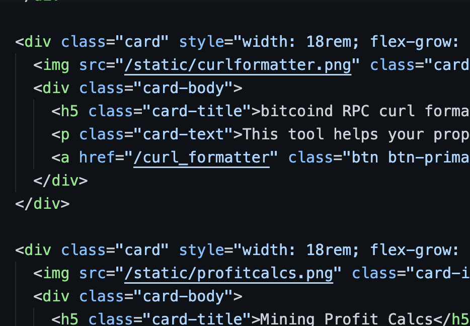

# this is a draft...

wen?  ...soon...

# PlebTools on EmbassyOS

Welcome to PlebTools - a collection of tools that Bitcoiners (Plebs and Maxis, alike) may find helpful.

# Motivation and Intent

**Motivation**: I am inspired by the open-source work of the Bitcoin ecosystem.  With the philosophy of "Verify, don't Trust" I decided to work on writing my own open-source code for tools I found online that were either (1) difficult for the average user to run, or (2) not open-source.

**Intent**: After teaching myself to code and experiencing the empowerment that brings, I intend to write tools, guides, etc aimed at enabling those who may be interested to do the same.  I "stand on the shoulders of giants" - those who have paved the way for me by making videos, sharing code, writing articles and guides or otherwise taking part in developer-focused education.  I have benefited from those who came before me and and seek to enable and empower the next generation to take part.

# A Note on Self-Hosting

This project would not be possible without the team at [Start9](https://twitter.com/start9labs) who created EmbassyOS.  With their reminders that the "Cloud" simply means "someone else's computer" and their out-of-the-box integration with the TOR network, Start9 seeks to provide every EmbassyOS user with a tool for self-sovereign computing.

Bitcoin empowers and incentivizes the individual to host their own software on their own computer and connect it to the world.  EmbassyOS runs with this idea by making it possible for the non-technical user to self-host software on computers they own and control.  Also, with their focus on allowing anyone to develop apps (or "package services") for their platform, anyone who can code can take part in this and write software meant to be run **for** and **by** the user.  Additionally, they make simple the ability to side-load these "services" in order to prevent themselves from being the gatekeepers on what software is allowed to run on the computers you own.

Learn more about "service packaging" in [Developer Docs](https://start9.com/latest/developer-docs/).

# List of tools (so far):

## OP_RETURN reader

Scan any bitcoin block for OP_RETURN messages.  Inspired by [nodeyez](https://github.com/vicariousdrama/nodeyez)

# How to install yourself

umm... just type 'make' and it should work...

yeah.... uhhh.. shoot.
